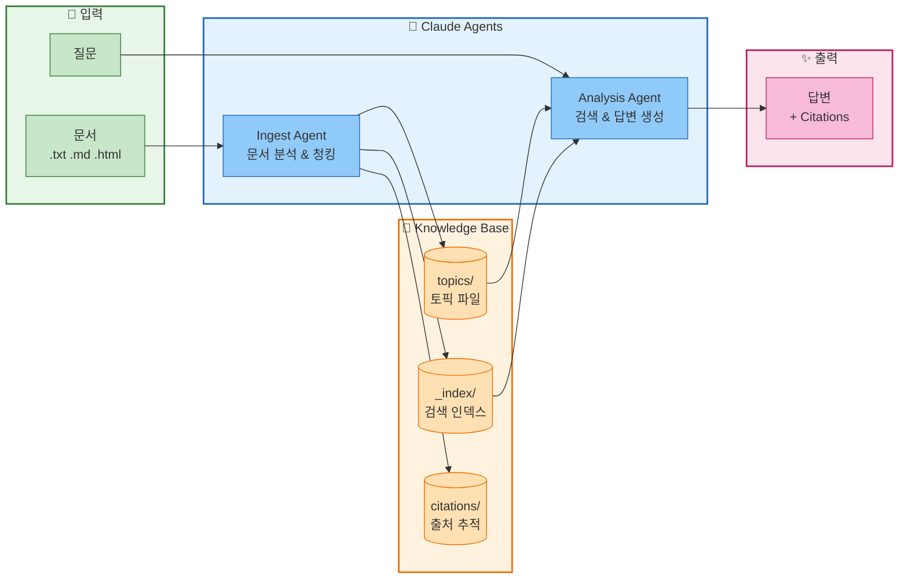

# Knowledge Base CLI

Claude Agent SDK 기반의 파일 지식 베이스 관리 CLI 도구입니다.

## 개요

문서를 입력받아 파일 기반 지식 베이스를 구축하고, AI 에이전트를 통해 질의응답을 수행하는 시스템입니다.



## 빠른 시작

### 설치

```bash
# 저장소 클론
git clone https://github.com/ghlee7411/claude-agent-w-blob-storage.git
cd claude-agent-w-blob-storage

# uv로 환경 설정 (권장)
uv sync

# 또는 pip 사용
pip install -r requirements.txt
```

### API 키 설정

```bash
export ANTHROPIC_API_KEY='your-api-key-here'
```

### 기본 사용

```bash
# 지식 베이스 초기화
uv run python cli.py init

# 문서 추가
uv run python cli.py ingest ./docs/guide.txt

# 질문하기
uv run python cli.py ask "Python의 GIL이란?"

# 상태 확인
uv run python cli.py status
```

## CLI 명령어

### 문서 관리

| 명령어 | 설명 | 예시 |
|--------|------|------|
| `init` | 지식 베이스 초기화 | `python cli.py init` |
| `ingest` | 파일에서 문서 추가 | `python cli.py ingest ./doc.txt` |
| `ingest-text` | 텍스트 직접 추가 | `python cli.py ingest-text "내용"` |

### 질의응답

| 명령어 | 설명 | 예시 |
|--------|------|------|
| `ask` | 질문하기 | `python cli.py ask "질문"` |
| `summary` | 지식 베이스 요약 | `python cli.py summary` |
| `gaps` | 지식 갭 분석 | `python cli.py gaps "python"` |

### 조회 및 검색

| 명령어 | 설명 | 예시 |
|--------|------|------|
| `list` | 토픽 목록 | `python cli.py list [category]` |
| `search` | 키워드 검색 | `python cli.py search "concurrency"` |
| `read` | 토픽 읽기 | `python cli.py read python/gil` |
| `status` | 통계 확인 | `python cli.py status` |

### 유지보수

| 명령어 | 설명 | 예시 |
|--------|------|------|
| `rebuild-index` | 인덱스 재구축 | `python cli.py rebuild-index` |

### 공통 옵션

```bash
--kb, -k      # 지식 베이스 경로 (기본: ./knowledge_base)
--model, -m   # Claude 모델 (기본: claude-sonnet-4-20250514)
```

## 사용 예시

### 문서 인제스트

```bash
# 파일에서 인제스트
python cli.py ingest ./docs/python_guide.txt

# 여러 파일 인제스트
for f in ./docs/*.md; do python cli.py ingest "$f"; done

# 텍스트 직접 인제스트
python cli.py ingest-text "Python의 GIL은 Global Interpreter Lock의 약자입니다." --source "manual"
```

### 질의응답

```bash
# 기본 질문
python cli.py ask "Python에서 멀티스레딩의 한계는?"

# 다른 모델 사용
python cli.py ask "asyncio와 스레딩의 차이점" --model claude-sonnet-4-20250514

# 지식 갭 분석
python cli.py gaps "concurrency"
```

### 검색 및 탐색

```bash
# 키워드 검색
python cli.py search "async"

# 카테고리별 목록
python cli.py list python

# 특정 토픽 읽기
python cli.py read python/gil
```

## 프로젝트 구조

```
claude-agent-w-blob-storage/
├── cli.py                    # CLI 진입점
├── pyproject.toml            # 프로젝트 설정 (uv)
├── agents/
│   ├── base_agent.py         # 베이스 에이전트
│   ├── ingest_agent.py       # 문서 인제스트 에이전트
│   └── analysis_agent.py     # 질의응답 에이전트
├── tools/
│   ├── kb_tools.py           # 지식베이스 도구
│   └── document_tools.py     # 문서 파싱 도구
├── storage/
│   ├── base.py               # 스토리지 인터페이스
│   └── filesystem.py         # 파일시스템 구현
└── knowledge_base/           # 데이터 저장소
    ├── topics/               # 토픽 (.md + .meta.json)
    ├── citations/            # 원본 출처
    ├── logs/                 # 작업 로그
    └── _index/               # 검색 인덱스
```

## 지식 베이스 구조

### Topics

각 토픽은 두 파일로 구성됩니다:

```
topics/python/
├── gil.md           # 마크다운 내용
└── gil.meta.json    # 메타데이터
```

**메타데이터 예시:**
```json
{
  "topic_id": "python/gil",
  "title": "Python GIL (Global Interpreter Lock)",
  "keywords": ["python", "gil", "concurrency"],
  "version": 3,
  "last_modified": "2024-01-07T10:30:00Z"
}
```

### Citations

원본 문서 추적:
```json
{
  "citation_id": "abc123",
  "source_document": "./docs/python_guide.txt",
  "contributed_topics": ["python/gil", "python/asyncio"]
}
```

## 성능 최적화

10,000~100,000개 문서 규모에서도 빠른 검색을 위해 다음 최적화가 적용되어 있습니다:

### 1. 인덱스 기반 검색

메타데이터 인덱스 캐싱으로 O(1) 조회:
```
_index/
├── topics_index.json      # 토픽 메타데이터 인덱스
└── inverted_index.json    # 역 인덱스
```

### 2. 역 인덱스 (Inverted Index)

키워드/제목/카테고리 → 토픽 매핑:
```json
{
  "keywords": {
    "python": ["python/gil", "python/asyncio"],
    "concurrency": ["python/gil", "concepts/threading"]
  }
}
```

### 3. 병렬 I/O

`asyncio.gather()`를 통한 다중 파일 병렬 처리:
- 인덱스 재구축: 모든 메타데이터 병렬 로드
- 토픽 읽기: 콘텐츠 + 메타데이터 동시 로드

### 인덱스 관리

```bash
# 인덱스 재구축 (메타데이터 기반)
python cli.py rebuild-index
```

## 아키텍처

### 동시성 설계

여러 에이전트가 동시에 실행될 수 있도록 설계되었습니다:

- **분산 메타데이터**: 토픽별 독립적 `.meta.json`
- **ETag 기반 낙관적 동시성**: 충돌 감지 및 재시도
- **UUID 기반 로그/인용**: 파일명 충돌 방지
- **점진적 인덱스 업데이트**: 전체 재구축 없이 증분 반영

### 스토리지 추상화

`storage/base.py`의 인터페이스를 구현하면 다른 스토리지로 전환 가능:

```python
from storage import BaseStorage

class AzureBlobStorage(BaseStorage):
    async def read(self, path: str) -> StorageResult:
        # Azure Blob API 구현
        pass
```

## 개발

### 환경 설정

```bash
# uv 설치 (없는 경우)
curl -LsSf https://astral.sh/uv/install.sh | sh

# 개발 환경 설정
uv sync

# 가상 환경 활성화 (선택)
source .venv/bin/activate
```

### 테스트

```bash
uv run pytest
```

## 로드맵

- [x] Claude Agent SDK 통합
- [x] Typer CLI
- [x] 파일 시스템 스토리지
- [x] 분산 메타데이터 구조
- [x] ETag 기반 동시성 제어
- [x] 성능 최적화 (인덱스, 병렬 I/O)
- [ ] Azure Blob Storage 지원
- [ ] AWS S3 지원
- [ ] 웹 UI

## 라이선스

MIT License
