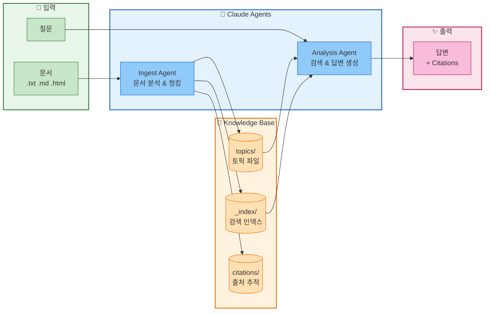

# Knowledge Base CLI

**AI가 자율적으로 조직하는 유연한 지식 베이스 시스템**

Claude Agent SDK 기반의 파일 저장형 지식 관리 도구입니다. 문서를 입력하면 AI Agent가 내용을 분석해서 최적의 구조로 자동 조직화하고, 나중에 지능적으로 검색/분석할 수 있습니다.

## ✨ 핵심 특징

- 🧠 **AI 자율 조직화**: Agent가 문서를 분석해서 카테고리, 토픽, 관계를 자동으로 결정
- 🎯 **완전 유연한 구조**: 고정된 스키마 없음 - 어떤 종류의 지식이든 저장 가능
- 📚 **지능형 지식 그래프**: 토픽 간 관계를 자동으로 연결하고 추적
- 🔒 **동시성 안전**: 여러 Agent가 동시에 작업해도 데이터 충돌 방지 (pessimistic locking)
- ⚡ **대규모 확장**: 10k-100k 문서 규모에 최적화 (역색인, 병렬 I/O, 캐싱)
- 🔄 **클라우드 준비**: 추상화된 스토리지 레이어로 Azure Blob/AWS S3 마이그레이션 가능
- 📖 **출처 추적**: 모든 지식의 원본 문서 자동 추적



## 빠른 시작

### 설치

```bash
# 1. 저장소 클론
git clone https://github.com/ghlee7411/claude-agent-w-blob-storage.git
cd claude-agent-w-blob-storage

# 2. uv로 환경 설정 (권장)
uv sync

# 3. API 키 설정 (.env 파일 생성)
echo "ANTHROPIC_API_KEY='your-api-key-here'" > .env
# 또는 환경 변수로 설정
export ANTHROPIC_API_KEY='your-api-key-here'
```

### 기본 사용

```bash
# 지식 베이스 초기화
uv run python cli.py init

# 문서 추가
uv run python cli.py ingest ./docs/guide.txt

# 질문하기
uv run python cli.py ask "Python의 GIL이란?"

# 상태 확인
uv run python cli.py status
```

## CLI 명령어

### 문서 관리

| 명령어 | 설명 | 예시 |
|--------|------|------|
| `init` | 지식 베이스 초기화 | `python cli.py init` |
| `ingest` | 파일에서 문서 추가 | `python cli.py ingest ./doc.txt` |
| `ingest-text` | 텍스트 직접 추가 | `python cli.py ingest-text "내용"` |

### 질의응답

| 명령어 | 설명 | 예시 |
|--------|------|------|
| `ask` | 질문하기 | `python cli.py ask "질문"` |
| `summary` | 지식 베이스 요약 | `python cli.py summary` |
| `gaps` | 지식 갭 분석 | `python cli.py gaps "python"` |

### 조회 및 검색

| 명령어 | 설명 | 예시 |
|--------|------|------|
| `list` | 토픽 목록 | `python cli.py list [category]` |
| `search` | 키워드 검색 | `python cli.py search "concurrency"` |
| `read` | 토픽 읽기 | `python cli.py read python/gil` |
| `status` | 통계 확인 | `python cli.py status` |

### 유지보수

| 명령어 | 설명 | 예시 |
|--------|------|------|
| `rebuild-index` | 인덱스 재구축 | `python cli.py rebuild-index` |

### 공통 옵션

```bash
--kb, -k      # 지식 베이스 경로 (기본: ./knowledge_base)
--model, -m   # Claude 모델 (기본: claude-sonnet-4-20250514)
```

## 💡 사용 예시

### 📥 문서 인제스트 - AI가 자동으로 조직화

```bash
# 샘플 문서 인제스트
uv run python cli.py ingest ./samples/python_gil.txt
```

**IngestAgent가 자동으로:**
1. 문서 내용 분석 (Python GIL 개념 파악)
2. 기존 지식 베이스 검색 (관련 토픽 있는지 확인)
3. 최적의 구조 결정:
   ```
   topics/python/gil.md              # GIL 개념
   topics/python/threading.md        # 멀티스레딩 제약
   topics/concepts/concurrency.md    # 일반 동시성 개념
   ```
4. 토픽 간 관계 연결 (`related_topics`)
5. 출처 추적 (`citations/abc123.json`)
6. 검색 인덱스 자동 업데이트

```bash
# 여러 파일 한꺼번에 인제스트
for f in ./samples/*.txt; do uv run python cli.py ingest "$f"; done

# 텍스트 직접 인제스트 (메모, 간단한 노트)
uv run python cli.py ingest-text "Python 3.13부터 GIL을 선택적으로 비활성화할 수 있다." --source "python-news"
```

### 🔍 질의응답 - AI가 지식을 종합해서 답변

```bash
# 기본 질문
uv run python cli.py ask "Python에서 멀티스레딩의 한계는?"
```

**AnalysisAgent가 자동으로:**
1. 질문 의도 파악 (Python, 멀티스레딩, 제약사항)
2. 관련 키워드로 검색 (`python`, `threading`, `concurrency`)
3. 연관된 토픽 읽기 (`python/gil`, `python/threading`, `concepts/concurrency`)
4. `related_topics` 따라가며 추가 컨텍스트 수집
5. 출처와 함께 종합 답변 생성

```bash
# 다른 모델 사용
uv run python cli.py ask "asyncio와 스레딩의 차이점은?" --model claude-sonnet-4-20250514

# 지식 갭 분석 (없는 정보 파악)
uv run python cli.py gaps "concurrency"

# 전체 지식 베이스 요약
uv run python cli.py summary
```

### 🔎 검색 및 탐색

```bash
# 키워드 검색 (역색인 사용, O(1) 속도)
uv run python cli.py search "async"
# 출력: python/asyncio, javascript/async-await, concepts/asynchronous-programming

# 카테고리별 목록
uv run python cli.py list python
# 출력: python/gil, python/asyncio, python/threading, python/multiprocessing

# 특정 토픽 읽기 (Markdown 렌더링)
uv run python cli.py read python/gil

# 통계 확인
uv run python cli.py status
# 출력: 총 토픽 수, 카테고리 수, 인용 수, 저장 공간 등
```

### 🧪 실제 워크플로우 예시

```bash
# 1. 초기화
uv run python cli.py init

# 2. 회사 기술 문서 수집
for doc in ./company-docs/*.md; do
  uv run python cli.py ingest "$doc"
done

# 3. 상태 확인
uv run python cli.py status
# 출력: 50 topics, 12 categories, 45 citations

# 4. 특정 주제 검색
uv run python cli.py search "authentication"
# 출력: security/oauth2, security/jwt, api/auth-flow

# 5. 신규 개발자 온보딩 질문
uv run python cli.py ask "우리 인증 시스템은 어떻게 동작하나요?"
# AI가 관련 토픽들을 종합해서 답변 + 출처 제공

# 6. 지식 갭 발견
uv run python cli.py gaps "deployment"
# 출력: "배포 관련 문서가 부족합니다. 다음 주제를 추가하세요: CI/CD, 환경 설정, 모니터링"

# 7. 인덱스 재구축 (필요시)
uv run python cli.py rebuild-index
```

## 프로젝트 구조

```
claude-agent-w-blob-storage/
├── cli.py                    # CLI 진입점
├── pyproject.toml            # 프로젝트 설정 (uv)
├── agents/
│   ├── base_agent.py         # 베이스 에이전트
│   ├── ingest_agent.py       # 문서 인제스트 에이전트
│   └── analysis_agent.py     # 질의응답 에이전트
├── tools/
│   ├── kb_tools.py           # 지식베이스 도구
│   └── document_tools.py     # 문서 파싱 도구
├── storage/
│   ├── base.py               # 스토리지 인터페이스
│   └── filesystem.py         # 파일시스템 구현
└── knowledge_base/           # 데이터 저장소
    ├── topics/               # 토픽 (.md + .meta.json)
    ├── citations/            # 원본 출처
    ├── logs/                 # 작업 로그
    └── _index/               # 검색 인덱스
```

## 📂 지식 베이스 구조

지식 베이스는 **분산 메타데이터 아키텍처**로 설계되어 여러 Agent가 동시에 작업할 수 있습니다:

```
knowledge_base/
├── topics/                          # 💎 실제 지식 콘텐츠
│   ├── python/
│   │   ├── gil.md                  # 내용 (Markdown)
│   │   ├── gil.meta.json           # 메타데이터
│   │   ├── asyncio.md
│   │   └── asyncio.meta.json
│   ├── javascript/
│   │   ├── promises.md
│   │   └── promises.meta.json
│   └── concepts/
│       ├── concurrency.md
│       └── concurrency.meta.json
├── citations/                       # 📚 원본 문서 추적
│   ├── abc123_2024-01-07.json
│   └── def456_2024-01-08.json
├── logs/                            # 📝 작업 로그 (분산)
│   └── agent-xyz_timestamp_id.json
└── _index/                          # ⚡ 성능 최적화
    ├── topics_index.json           # 전체 토픽 메타데이터 캐시
    └── inverted_index.json         # 키워드 역색인 (O(1) 검색)
```

### 🎯 유연한 구조의 실제 예시

같은 문서(`python_gil.txt`)도 Agent가 내용에 따라 다양하게 조직화할 수 있습니다:

**예시 1: 언어별 구조**
```
topics/
├── python/
│   ├── gil.md
│   ├── threading.md
│   └── multiprocessing.md
└── concepts/
    └── concurrency.md
```

**예시 2: 개념별 구조**
```
topics/
├── programming-languages/
│   └── python-gil.md
└── performance/
    └── concurrency-patterns.md
```

**Agent가 문서 내용과 기존 지식 베이스를 분석해서 가장 적합한 구조를 자율적으로 결정합니다.**

### 📄 토픽 파일 구조

각 토픽은 **콘텐츠(`.md`) + 메타데이터(`.meta.json`)** 쌍으로 저장됩니다:

**콘텐츠 파일** (`topics/python/gil.md`):
```markdown
# Python GIL (Global Interpreter Lock)

GIL은 Python의 CPython 구현에서 하나의 스레드만 Python 바이트코드를 실행할 수 있도록 하는 뮤텍스입니다...

## 관련 개념
- Python Threading
- Multiprocessing
- Asyncio
```

**메타데이터 파일** (`topics/python/gil.meta.json`):
```json
{
  "topic_id": "python/gil",
  "title": "Python GIL (Global Interpreter Lock)",
  "version": 3,
  "keywords": ["python", "gil", "concurrency", "threading"],
  "related_topics": ["python/asyncio", "python/multiprocessing", "concepts/concurrency"],
  "citations": ["abc123"],
  "last_modified": "2024-01-07T10:30:00Z",
  "last_modified_by": "agent-a1b2c3d4"
}
```

### 📚 원본 문서 추적 (Citations)

모든 지식의 출처를 추적합니다:

```json
{
  "citation_id": "abc123",
  "source_document": "./samples/python_gil.txt",
  "processed_at": "2024-01-07T10:00:00Z",
  "processed_by": "agent-a1b2c3d4",
  "contributed_topics": ["python/gil", "python/threading", "concepts/concurrency"],
  "summary": "Python GIL 개념 및 멀티스레딩 제약사항 설명"
}
```

## 성능 최적화

10,000~100,000개 문서 규모에서도 빠른 검색을 위해 다음 최적화가 적용되어 있습니다:

### 1. 인덱스 기반 검색

메타데이터 인덱스 캐싱으로 O(1) 조회:
```
_index/
├── topics_index.json      # 토픽 메타데이터 인덱스
└── inverted_index.json    # 역 인덱스
```

### 2. 역 인덱스 (Inverted Index)

키워드/제목/카테고리 → 토픽 매핑:
```json
{
  "keywords": {
    "python": ["python/gil", "python/asyncio"],
    "concurrency": ["python/gil", "concepts/threading"]
  }
}
```

### 3. 병렬 I/O

`asyncio.gather()`를 통한 다중 파일 병렬 처리:
- 인덱스 재구축: 모든 메타데이터 병렬 로드
- 토픽 읽기: 콘텐츠 + 메타데이터 동시 로드

### 인덱스 관리

```bash
# 인덱스 재구축 (메타데이터 기반)
python cli.py rebuild-index
```

## 🏗️ 아키텍처

이 시스템은 **3-Tier 모듈 아키텍처**로 설계되어 있습니다:

```
┌─────────────────────────────────────────────┐
│         CLI Layer (cli.py)                  │  ← 사용자 인터페이스
│         - Typer CLI commands                │
│         - Rich UI rendering                 │
└─────────────────────────────────────────────┘
                    ↓
┌─────────────────────────────────────────────┐
│         Agent Layer (agents/)               │  ← AI 오케스트레이션
│         - IngestAgent: 문서 분석 & 구조화   │
│         - AnalysisAgent: 검색 & 답변 생성   │
│         - Claude Agent SDK @tool 통합       │
└─────────────────────────────────────────────┘
                    ↓
┌─────────────────────────────────────────────┐
│         Tools Layer (tools/)                │  ← 비즈니스 로직
│         - KnowledgeBaseTools: CRUD          │
│         - DocumentTools: 파싱/분석          │
│         - 검색, 인덱싱, 통계                 │
└─────────────────────────────────────────────┘
                    ↓
┌─────────────────────────────────────────────┐
│         Storage Layer (storage/)            │  ← 데이터 영속성
│         - BaseStorage: 추상 인터페이스       │
│         - FileSystemStorage: 로컬 구현       │
│         - [Future] AzureBlob, S3            │
└─────────────────────────────────────────────┘
```

### 🔒 동시성 안전 설계

여러 Agent가 동시에 실행되어도 안전하게 작동합니다:

#### 1. **Pessimistic File Locking** (최근 추가)
```python
# 파일 쓰기 시 자동으로 배타적 잠금
async with storage.locked(path, timeout=30):
    content = await storage.read(path)
    # ... 수정 ...
    await storage.write(path, new_content)
# 자동으로 잠금 해제
```

**특징:**
- `fcntl` 기반 원자적 잠금 (Linux/Unix)
- 자동 만료: 크래시 발생 시에도 교착 상태(deadlock) 방지
- 타임아웃 대기: 다른 Agent가 작업 중이면 대기
- Context manager로 안전한 잠금 해제 보장

#### 2. **분산 메타데이터**
- 토픽별 독립적 `.meta.json` → 병렬 작업 가능
- 중앙 메타데이터 파일 없음 → 병목 현상 없음

#### 3. **ETag 기반 낙관적 동시성**
- MD5 해시로 파일 변경 감지
- 충돌 시 자동 재시도 메커니즘

#### 4. **UUID 기반 충돌 방지**
- 로그/인용 파일명: `agent-{uuid}_{timestamp}_{id}.json`
- 여러 Agent가 동시에 로그를 작성해도 충돌 없음

#### 5. **점진적 인덱스 업데이트**
- 토픽 수정 시 해당 토픽만 인덱스 업데이트
- 전체 재구축 불필요 → 성능 향상

### 🔄 스토리지 추상화

`storage/base.py`의 인터페이스를 구현하면 다른 스토리지로 쉽게 전환할 수 있습니다:

```python
from storage import BaseStorage

# 현재: 로컬 파일시스템
storage = FileSystemStorage("./knowledge_base")

# 미래: Azure Blob Storage
class AzureBlobStorage(BaseStorage):
    async def read(self, path: str) -> StorageResult:
        # Azure Blob의 Get Blob API 호출
        blob_client = self.container.get_blob_client(path)
        content = blob_client.download_blob().readall()
        return StorageResult(success=True, data=content)

    async def write(self, path: str, content: str) -> StorageResult:
        # Azure Blob의 Upload Blob API 호출
        blob_client = self.container.get_blob_client(path)
        blob_client.upload_blob(content, overwrite=True)
        return StorageResult(success=True)

    async def acquire_lock(self, path: str) -> str:
        # Azure Blob의 Lease 메커니즘 사용
        blob_client = self.container.get_blob_client(path)
        lease = blob_client.acquire_lease(duration=60)
        return lease.id

# 미래: AWS S3
storage = S3Storage(bucket_name="my-kb", region="us-east-1")
```

**설계 원칙:**
- 모든 I/O는 `BaseStorage` 인터페이스를 통해서만 수행
- Agent와 Tools 레이어는 스토리지 구현을 알 필요 없음
- 클라우드 마이그레이션 시 `storage/` 디렉토리만 수정

## 🛠️ 개발

### 환경 설정

```bash
# 1. uv 설치 (없는 경우)
curl -LsSf https://astral.sh/uv/install.sh | sh

# 2. 저장소 클론
git clone https://github.com/ghlee7411/claude-agent-w-blob-storage.git
cd claude-agent-w-blob-storage

# 3. 개발 환경 설정
uv sync

# 4. .env 파일 생성
cp .env.example .env  # 또는 직접 생성
echo "ANTHROPIC_API_KEY=your-key-here" >> .env

# 5. 가상 환경 활성화 (선택)
source .venv/bin/activate
```

### 프로젝트 구조 이해

```
claude-agent-w-blob-storage/
├── cli.py                     # CLI 진입점 (Typer)
├── pyproject.toml             # 프로젝트 설정 (uv)
├── .env                       # 환경 변수 (API 키)
│
├── agents/                    # 🤖 Agent 레이어
│   ├── base_agent.py          # BaseAgent: 공통 기능
│   ├── ingest_agent.py        # IngestAgent: 문서 처리
│   └── analysis_agent.py      # AnalysisAgent: 질의응답
│
├── tools/                     # 🔧 Tools 레이어
│   ├── kb_tools.py            # KnowledgeBaseTools: CRUD, 검색, 인덱싱
│   └── document_tools.py      # DocumentTools: 문서 파싱
│
├── storage/                   # 💾 Storage 레이어
│   ├── base.py                # BaseStorage: 추상 인터페이스
│   └── filesystem.py          # FileSystemStorage: 로컬 구현
│
├── samples/                   # 📚 샘플 문서
│   ├── python_gil.txt
│   ├── prompt_engineering.md
│   └── ...
│
└── knowledge_base/            # 📂 데이터 저장소 (생성됨)
    ├── topics/                # 토픽 (.md + .meta.json)
    ├── citations/             # 출처 추적
    ├── logs/                  # 작업 로그
    ├── _index/                # 검색 인덱스
    └── _locks/                # 파일 잠금 (임시)
```

### 테스트

```bash
# 전체 테스트 실행
uv run pytest

# 특정 테스트 실행
uv run pytest tests/test_storage.py

# 커버리지 포함
uv run pytest --cov=. --cov-report=html
```

### 새로운 Storage 구현 추가하기

```python
# storage/azure_blob.py
from storage.base import BaseStorage, StorageResult

class AzureBlobStorage(BaseStorage):
    def __init__(self, connection_string: str, container: str):
        self.client = BlobServiceClient.from_connection_string(connection_string)
        self.container = self.client.get_container_client(container)

    async def read(self, path: str) -> StorageResult:
        try:
            blob = self.container.get_blob_client(path)
            content = blob.download_blob().readall().decode('utf-8')
            return StorageResult(success=True, data=content)
        except Exception as e:
            return StorageResult(success=False, error=str(e))

    async def write(self, path: str, content: str) -> StorageResult:
        try:
            blob = self.container.get_blob_client(path)
            blob.upload_blob(content, overwrite=True)
            return StorageResult(success=True)
        except Exception as e:
            return StorageResult(success=False, error=str(e))

    async def acquire_lock(self, path: str, timeout: int = 30) -> str:
        # Azure Blob Lease 사용
        blob = self.container.get_blob_client(path)
        lease = blob.acquire_lease(duration=min(timeout, 60))
        return lease.id

    async def release_lock(self, path: str, lock_id: str) -> bool:
        blob = self.container.get_blob_client(path)
        blob.release_lease(lock_id)
        return True
```

### 코드 스타일

```bash
# 포맷팅 (Black)
uv run black .

# 린팅 (Ruff)
uv run ruff check .

# 타입 체크 (mypy)
uv run mypy .
```

## 🎯 사용 사례

이 시스템은 다음과 같은 상황에 유용합니다:

- 📖 **기술 문서 관리**: API 문서, 가이드, 튜토리얼을 AI가 자동으로 분류하고 연결
- 🏢 **회사 지식 베이스**: 회의록, 내부 문서, FAQ를 중앙화하고 빠르게 검색
- 🔬 **연구 노트**: 논문, 실험 결과, 아이디어를 구조화하고 관계 추적
- 💼 **개인 지식 관리**: 학습 자료, 북마크, 메모를 AI가 조직화
- 🤖 **RAG 시스템**: LLM 애플리케이션을 위한 지식 소스로 활용

## 🗺️ 로드맵

### ✅ 완료
- [x] Claude Agent SDK 통합 (MCP 기반 @tool 패턴)
- [x] Typer CLI + Rich UI
- [x] 파일 시스템 스토리지 (fcntl 기반)
- [x] 분산 메타데이터 아키텍처
- [x] **Pessimistic file locking** (동시성 안전)
- [x] ETag 기반 낙관적 동시성 제어
- [x] 성능 최적화 (역색인, 병렬 I/O, 캐싱)
- [x] 자동 `.env` 로딩 (python-dotenv)
- [x] 다중 문서 포맷 지원 (.txt, .md, .html)
- [x] 출처 추적 (Citations)

### 🚧 진행 중
- [ ] Azure Blob Storage 구현
  - [ ] Lease 기반 잠금 메커니즘
  - [ ] 마이그레이션 도구
- [ ] AWS S3 Storage 구현
  - [ ] Conditional writes / DynamoDB 잠금
  - [ ] 마이그레이션 도구

### 📋 계획 중
- [ ] 웹 UI (Streamlit / Gradio)
- [ ] Vector embedding 지원 (의미 기반 검색)
- [ ] 더 많은 문서 포맷 (.pdf, .docx, .pptx)
- [ ] 버전 관리 UI (토픽 변경 이력)
- [ ] API 서버 모드 (FastAPI)
- [ ] 다국어 지원
- [ ] 자동 요약 및 키워드 추출 개선

## 라이선스

MIT License
